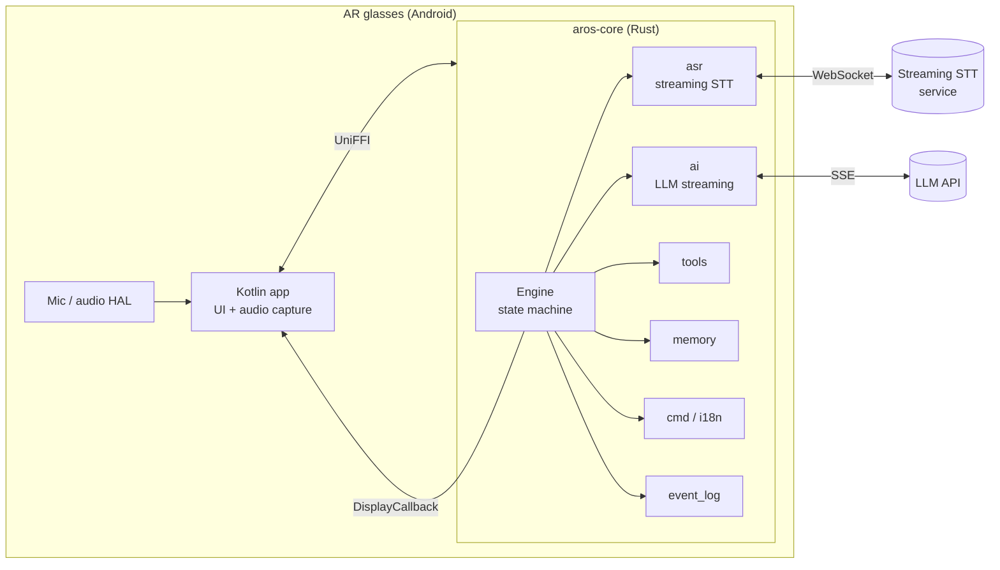

# aros-core

The Rust engine behind **ArOS** — a voice-agent layer for AR smart glasses (INMO Air3, Even Realities G2).

One portable core, multiple frontends: `aros-core` compiles to a `cdylib` and is exposed to Kotlin on Android through [UniFFI](https://mozilla.github.io/uniffi-rs/). All core logic runs and is tested on the host — no device, no emulator, no JNI in the test loop (**84 host-side tests**).

## What it does

Feed it a microphone stream and a display callback; it turns the glasses into a real-time conversation device:

- **Streaming ASR** (`asr`) — WebSocket client for streaming speech-to-text: incremental partial/final tokens, speaker diarization, silence-based auto-finalization, reconnect handling
- **Live translation** (`translate`, `asr`) — bidirectional Japanese⇄Chinese subtitles rendered on-lens as you talk; trait-based backend so engines are swappable
- **AI dialogue & conversation coach** (`ai`, `state`) — streaming LLM responses (OpenRouter), a dialogue mode with context, and real-time reply suggestions during live conversations
- **Tool use** (`tools`) — a Claude-style tool registry the LLM can call into (device actions, memory writes, …)
- **Memory** (`memory`) — global memory plus "guide mode" task-specific context, injected into prompts across sessions
- **Voice commands** (`cmd`, `i18n`) — locale-aware trigger-phrase parser for hands-free mode switching and settings
- **Even G2 BLE protocol** (`ble`) — packet layer for Even Realities G2 glasses (based on the community reverse-engineered protocol)
- **Infrastructure** — PCM analysis & silence detection (`audio`), ping/connectivity monitor (`net`), JSONL event log for offline analysis (`event_log`), persisted config (`config`)

## Architecture



The platform boundary is a single `DisplayCallback` trait: Android implements it in Kotlin (via UniFFI callbacks), integration tests implement it as a mock. The engine never touches platform APIs directly.

## Building

```bash
# host: run everything
cargo test

# Android: build the shared library + Kotlin bindings
cargo ndk -t arm64-v8a build --release
cargo run --bin uniffi-bindgen generate src/uniffi_interface.udl --language kotlin
```

## Design notes

- **TLS**: `rustls` is pinned to the `ring` crypto provider — `aws-lc-rs` hangs intermittently on `aarch64-android`.
- **Silence auto-finalization**: partial ASR tokens are force-finalized after 3 s of silence so subtitles never stall on an unfinished phrase.
- **Everything async on one runtime**: ASR socket, LLM streams, ping monitor and timers share a tokio multi-thread runtime owned by the engine.

## Status

Personal project under active development; this crate is the stable core. The Android (Kotlin) frontend for INMO Air3 and the Even Realities G2 (TypeScript/EvenHub) frontend live in separate repositories that are not public yet.

## License

MIT
